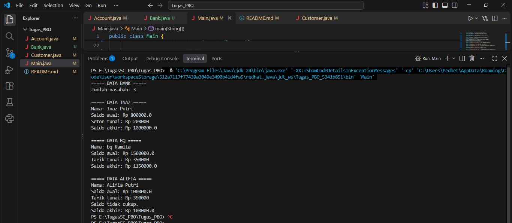

# Tugas_PBO


# Program Bank Sederhana

## Deskripsi

Program ini merupakan implementasi sederhana sistem bank menggunakan konsep Object-Oriented Programming (OOP) pada Java.

Program terdiri dari 4 class:

* `Bank.java` — menyimpan data nasabah menggunakan array `Customer[]`.
* `Customer.java` — menyimpan informasi nama nasabah dan rekening.
* `Account.java` — mengelola saldo, setor tunai, dan tarik tunai.
* `Main.java` — menjalankan program dan melakukan percobaan terhadap method yang tersedia.

## Array

Class `Bank` menggunakan array objek `Customer` untuk menyimpan data nasabah.

```java
private Customer[] customers;

customers = new Customer[10];
```
Array tersebut dapat menyimpan maksimal 10 nasabah.


